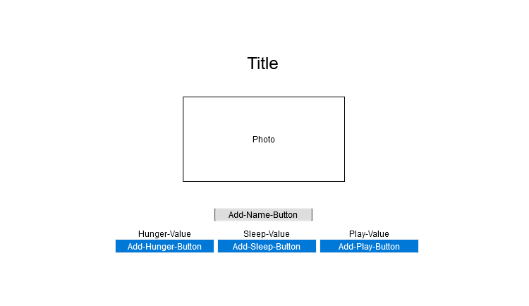

# Welcome to myCapyPal
My first project with General Assembly.
Deployed here: https://cotsao.github.io/My-Capy-Pal/
## Index:

- [Specifications](#Specifications)
- [User Stories](#user-stories)
- [Wireframe](#wireframe)
- [To be implemented](#milestones)

## Specifications

- Base Requirements
    - Create a repo for your tamagotchi pet
    - Create a Class (JS Class, look at your notes if your forget) for your tamagotchi
    - Instantiate your Tamagotchi
    - Display a character of your choice on the screen to represent your pet
    - Display the following metrics for your pet:
    - Hunger (1-10 scale)
    - Sleepiness (1-10 scale)
    - Boredom (1-10 scale)
    - Age
    - Add buttons to the screen to feed your pet, turn off the lights, and play with your pet.
    - Add the ability to name your pet.
    - Style the page.
    - Increase your pet's age every x minutes
    - Increase your pet's Hunger, Sleepiness, and Bored metrics on an interval of your choosing.
    - You pet should die if Hunger, Boredom, or Sleepiness hits 10.
- Additional Features
    - Progress bar for meters
    - Scoreboard
    - Changing pet avatar based on age, hunger, sleepiness, and boredom
    - Sticker popup on incrementing values
    - Optional typing game to increment values

## User Stories
User will be prompted to input a name for their CapyPal. Upon inputting their name, the game will begin. Values of hunger, sleepiness, and boredom will begin at 100 and begin decreasing. When any value hits 0, the CapyPal will die, and the game will end, giving the user an option to try again. The user's previous CapyPal with the final age will be added to the scoreboard. To increase any value, the user may press the corresponding button, or type in the word below the button.
## Wireframe

## To be implemented or fixed
- Add rules page
- Hide meters until game begins
- Always show scoreboard
- Show cause of death
- Add events at specific age values
